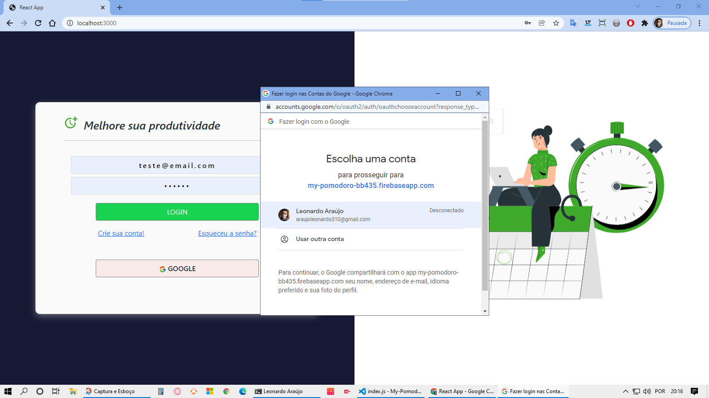
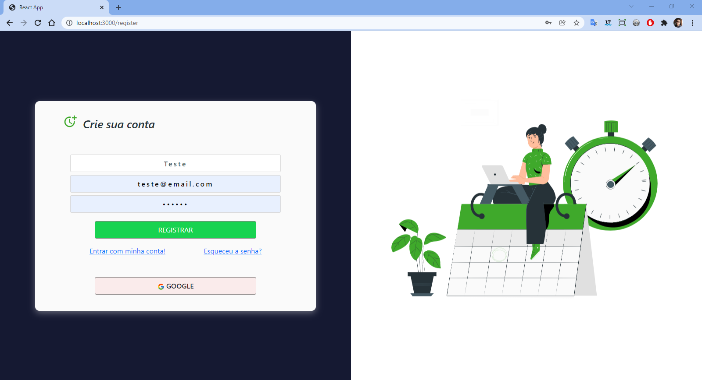
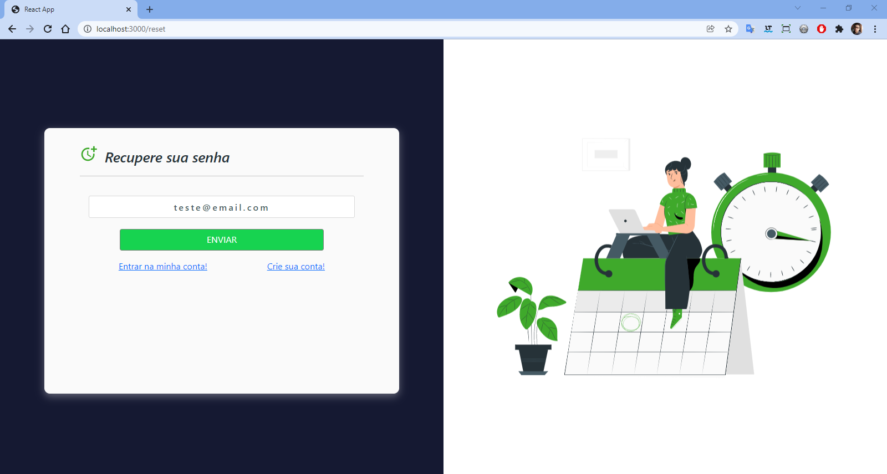
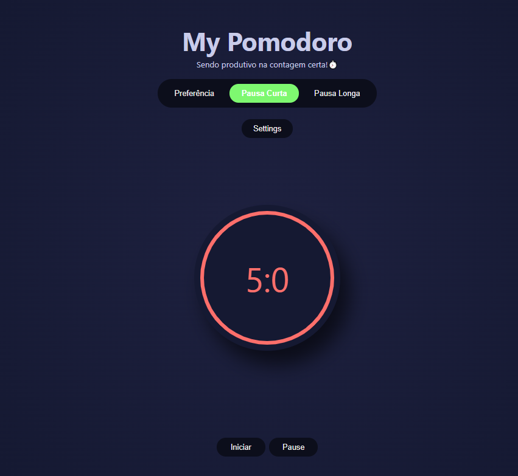
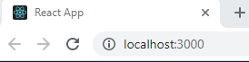

<h1>Projeto: My Pomoro ⏱️</h1>

    <em><strong>ÍNDICE</strong></em>

 
 

    <a href="#sobre" align=center>Sobre o projeto</a>&nbsp;&nbsp;&nbsp;
    <a href="#demostracao" align=center>Demostração do projeto</a>&nbsp;&nbsp;&nbsp; 
    <a href="#instalacao" align=center>Instalação</a>&nbsp;&nbsp;&nbsp;
    <a href="#linguagens" align=center>Linguagens & Frameworks</a>&nbsp;&nbsp;&nbsp;
    <a href="#referencias" align=center>Referências & Links</a>&nbsp;&nbsp;&nbsp;
    <a href="#biografia" align=center>Biografia</a> 

 

<h3 id="sobre">Sobre o projeto:</h3>

O projeto é um desafio “Pomodoro app”, do site voltado para praticar e elevar habilidades de programação e desenvolvimento, Frontend Mentor.

 

Este projeto refere-se a uma aplicação pomodoro, exclusiva para usuários cadastrados no banco de dados (Firebase).

Esta aplicação permite que o usuário escolha contagens(pomodro em ação, pausa curta e longa), como também escolher três opções de cores para efeitos.

<h4>Skills obtidas com esse projeto</h4>

 

✔️ Desenvolvimento e conexão combanco de dados Firebase;

✔️ Desenvolvimento de telas login, cadastro, troca de senha e home (app);

✔️ Login por autenticação de conta Google, ou endereço eletrônico com senha;

✔️ Notificações intuitivas;

✔️ Criação de Components

✔️ Manipulação de elementos root do React

✔️ Variáveis para estilização

 

<h3 id="status">Status</h3> 

**_Concluído 🚀_**

 

    <h3 id="demostracao">Demostração</h3>
     
    <h4>Login de usuário com email e senha<h4>
    
      
    <h4>Login conta Google<h4>
    
      
    <h4>Cadastro de usuário<h4>
    
      
     <h4>Recuperação de senha<h4>
    
      
    <h2> Aplicação Pomodoro </h2>
    <h3> Home app </h3>
    
     <h4>Configurações E Estilos de Cores<h4>
    
      

<h3 id="instalacao">Instalação</h3>

 

1 - Faça fork (clone) do projeto

2 - Abra um terminal e acesse a pasta do projeto

3 - Instale o package “node_module” com o comando **_npm install_** ou **_yarn install_** (caso use yarn)

 

 

4 - Depois de instalado o package, digite o comando **_npm start_** ou **_yarn start_** (caso tenha o yarn instalado)

 

 

5 - Em seu navegador de preferência, digite o endereço **_http://localhost:3000_**

 

 

<h3 id=linguagens>Linguagens & Frameworks</h3>

* React 
* Javascript
* CSS
* Html
* Firebase

> Dependências Instaladas 

- react: ^17.0.2
- react-bootstrap: ^2.0.3
- firebase: ^8.10.0
- react-firebase-hooks: ^3.0.4
- react-countdown-circle-timer: ^2.5.
- react-icons: ^4.3.1
- react-lottie: ^1.2.3
- react-router-dom: ^5.2.0
- react-toastify: ^8.1.0

 

<h3 align=center id="referencias"><i>Referências & Links </i>📖🙋‍♂️</h3> 

Desafio Pomodoro App - [Frontend Mentor](https://www.frontendmentor.io/challenges/pomodoro-app-KBFnycJ6G)

Create a Pomodoro Clock in React with the Context API - [freeCodeCamp advanced JavaScript 2021](https://youtu.be/0PnSEPm2UKY) de **Siphiwo Julayi**

 

<h3 id="autor">Biografia</h3> 

 Meu nome é Leonardo, mas gosto de ser o Leo. Estou me graduando em Sistemas de Informação. Sou Desenvolvedor Front-End (estagiário) na AjaxTI.
 

<h3 align=center><i>Gostos e Hobbies </i>📖🙋‍♂️</h3> 

Caminhar, correr, ciclismo, exercícios físicos, estudar, ler e aprender sobre desenvolvimento de sites e aplicações.
 

    <h3><strong>Contatos</strong></h3>
     
    
    &nbsp;&nbsp;&nbsp;&nbsp;&nbsp;&nbsp;&nbsp;&nbsp;&nbsp;
     
    &nbsp;&nbsp;&nbsp;&nbsp;&nbsp;&nbsp;&nbsp;&nbsp;&nbsp;
       
    &nbsp;&nbsp;&nbsp;&nbsp;&nbsp;&nbsp;&nbsp;&nbsp;&nbsp;
    

